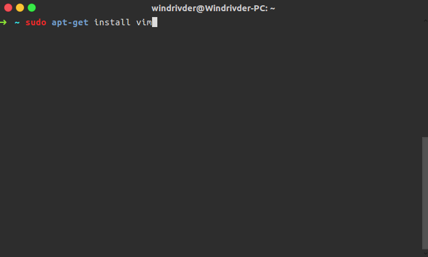
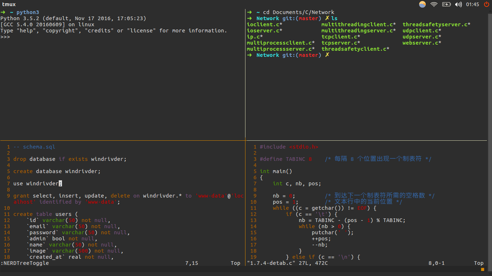

# MyTools
> 适用系统 Ubuntu 16.04

## 截图





## 安装

建议将使用的源修改为国内的阿里云的镜像

```shell
## /etc/apt/sources.list
deb http://mirrors.aliyun.com/ubuntu/ xenial main restricted universe multiverse
deb http://mirrors.aliyun.com/ubuntu/ xenial-security main restricted universe multiverse
deb http://mirrors.aliyun.com/ubuntu/ xenial-updates main restricted universe multiverse
deb http://mirrors.aliyun.com/ubuntu/ xenial-proposed main restricted universe multiverse
deb http://mirrors.aliyun.com/ubuntu/ xenial-backports main restricted universe multiverse
deb-src http://mirrors.aliyun.com/ubuntu/ xenial main restricted universe multiverse
deb-src http://mirrors.aliyun.com/ubuntu/ xenial-security main restricted universe multiverse
deb-src http://mirrors.aliyun.com/ubuntu/ xenial-updates main restricted universe multiverse
deb-src http://mirrors.aliyun.com/ubuntu/ xenial-proposed main restricted universe multiverse
deb-src http://mirrors.aliyun.com/ubuntu/ xenial-backports main restricted universe multiverse

$ sudo apt-get update	# !!! 记住一定要执行更行
```

> 执行`echo "ubuntu ALL=(ALL) NOPASSWD:ALL" >> /etc/sudoers`让当前用户执行`sudo`不需要密码

### 安装 vim+zsh+tmux

```shell
$ sudo apt-get install vim

$ sudo apt-get install git zsh curl -yq

$ sh -c "$(curl -fsSL https://raw.github.com/robbyrussell/oh-my-zsh/master/tools/install.sh)"	# 会要求输入当前用户的密码

$ sudo apt-get install tmux
```

### 配置

```shell
# 将项目中的三个文件复制到主目录下并改名
$ sudo cp vimrc ~/.vimrc
...
# 启动 Vim
:PluginInstall	# 自动安装插件，可能要等上一段时间
```

## 参考教程

[web_develop](https://github.com/dongweiming/web_develop/blob/master/setup.md)

[终极Shell](https://zhuanlan.zhihu.com/p/19556676?columnSlug=mactalk)

[强大的zsh配置文件](http://www.cnblogs.com/ma6174/archive/2012/05/08/2490921.html)

[Vim与Python真乃天作之合](http://codingpy.com/article/vim-and-python-match-in-heaven/)

